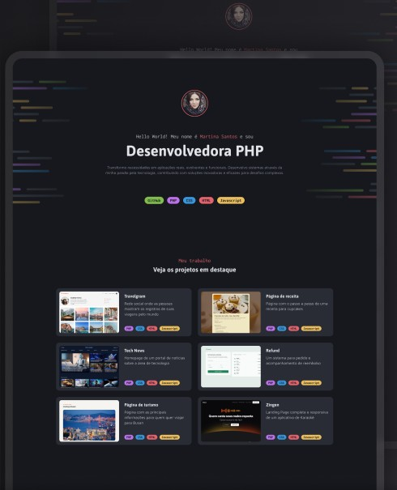

# Portfólio Dev

Projeto desenvolvido durante um desafio da trilha de **PHP** da **Rocketseat**, com o objetivo de aprimorar os fundamentos da linguagem através da manipulação de **arrays** e **variáveis**. O foco é criar uma aplicação dinâmica e estilosa que simula um portfólio pessoal.

---

## 📋 Descrição  
Este projeto tem como objetivo consolidar habilidades em:  
- Manipulação de **arrays** e **variáveis** com PHP  
- Estruturação de páginas com **HTML5**  
- Estilização utilizando **Tailwind CSS**

O resultado é um portfólio funcional, pronto para ser adaptado e utilizado por desenvolvedores para expor seus projetos e habilidades de forma visualmente atraente.

---

## 🚀 Tecnologias Utilizadas  

<p>
  <span style="background-color: #BB72E9; color: white; padding: 5px 10px; border-radius: 5px;">PHP</span>
  <span style="background-color: #E3646E; color: white; padding: 5px 10px; border-radius: 5px;">HTML5</span>
  <span style="background-color: #3996DB; color: white; padding: 5px 10px; border-radius: 5px;">Tailwind CSS</span>
</p>

---

## 🛠️ Como Executar o Projeto  

1. **Clone o repositório**  
   ```bash
   git clone <URL_DO_REPOSITORIO>
   cd portfolio-dev

2. **Rode com o servidor do php**
    ```bash
   php -S localhost:8080

